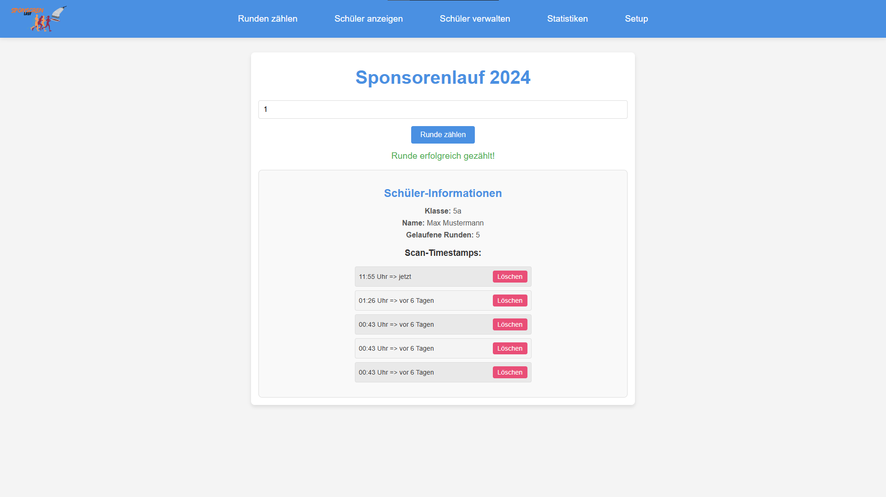
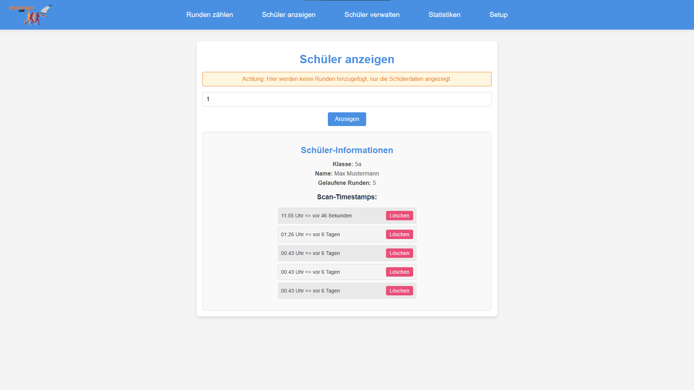
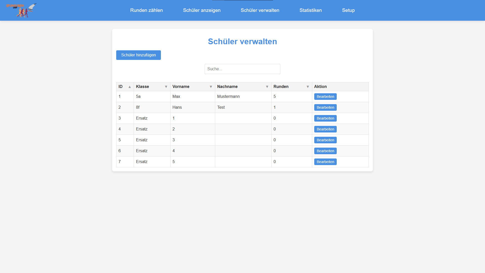
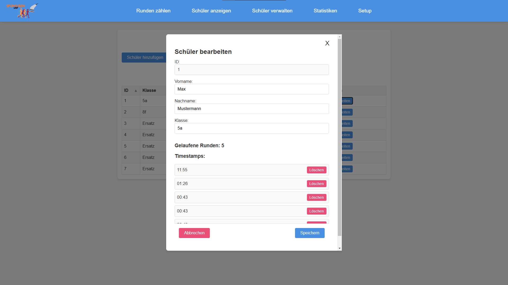
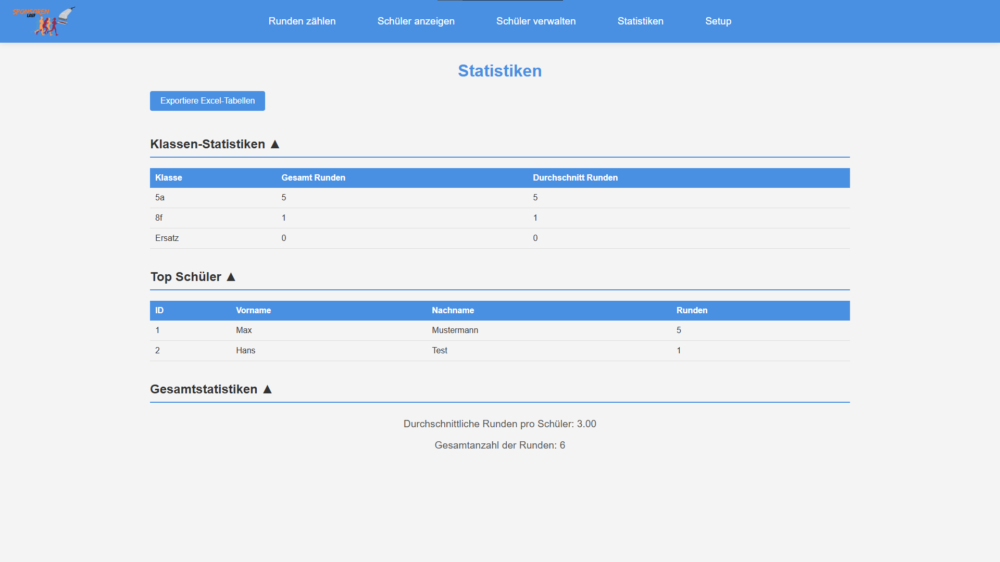
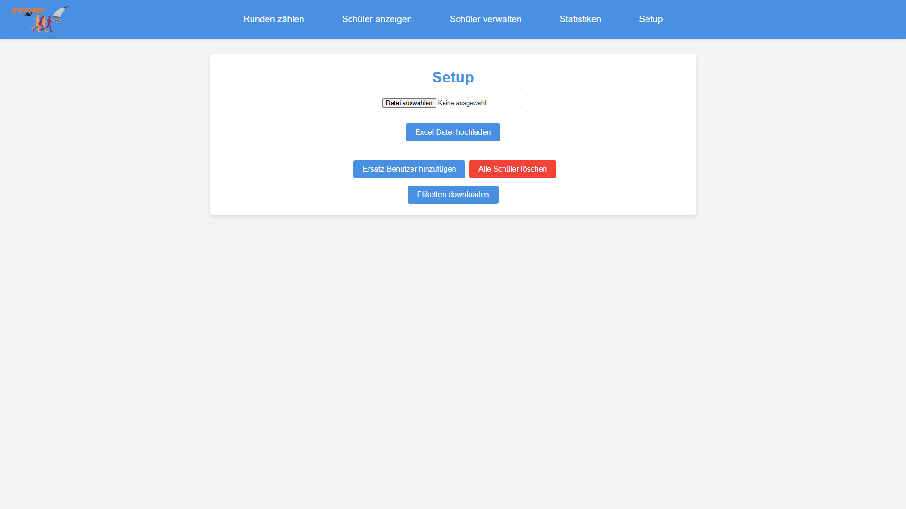

# Sponsorenlauf-Tool

🚀 **Modernes Sponsorenlauf-Management**  
Eine innovative digitale Lösung als Alternative zu herkömmlichen Stempelkarten bei Sponsorenläufen.

🌍 The tool is currently only available in German. If you want an English version or have special requirements, please create an issue or pull request! I'm happy to help. If you want to test a demo version, just write to me and I'll give you access.

---

## 💡 Prinzip
Jeder Schüler erhält eine eindeutige ID, die in der Datenbank hinterlegt ist. Diese ID wird ausgedruckt und verteilt. Beim Sponsorenlauf können die Schüler ihre ID an verschiedenen Stempelstationen (mit Barcode-Scannern) einlesen lassen.

### 🏁 Stempelstationen
- Raspberry Pi fungiert als WLAN-Router mit einem laufenden Script.
- Mindestens ein Laptop mit angeschlossenem Barcode-Scanner.
- Laptop muss mit dem WLAN des Raspberry Pi verbunden sein.

---

## 📸 Screenshots

<details>
  <summary><b>Screenshots anzeigen</b></summary>

  ### Scan-Ansicht:
  

  ### Daten eines Schülers abrufen
  

  ### Schüler-Management:
  

  ### Einzelne Schüler bearbeiten:
  

  ### Statistiken:
  

  ### Setup:
  

</details>

---

## 🚀 Installation

### 🖥️ Raspberry Pi Setup
Schau dir die [Anleitung](/raspberrySetup.md) an, wie du den Raspberry Pi installieren musst. 

### ⚙️ Node.js + NPM Installation
1. Verbinde dich per SSH mit deinem Raspberry:
    ```bash
    ssh <benutzer>@raspberry.local
    ```
2. Aktualisiere dein System:
    ```bash
    sudo apt update && sudo apt upgrade
    ```
3. Installiere Node.js:
    ```bash
    curl -fsSL https://deb.nodesource.com/setup_20.x | sudo -E bash -
    sudo apt install -y nodejs
    ```

### 📁 Repository Setup
1. **Klone das Repository**:
    ```bash
    git clone https://github.com/Florian2807/sponsorenlauf-tool.git
    cd sponsorenlauf-tool
    ```
> [!NOTE]
> Falls `git` noch nicht installiert ist, installiere es mit:
> ```bash
> sudo apt install git
> ```


2. **Installiere alle benötigten Pakete**:
    ```bash
    npm install
    ```

3. **Initialisiere die Datenbank**:
    ```bash
    node initDB.js
    ```

4. **Erstelle das Build**:
    ```bash
    npm run build
    ```

---

## ⏩ Systemd - Prozessmanagement
Verwende **systemd**, um das Tool dauerhaft im Hintergrund laufen zu lassen.

1. **Erstelle eine systemd Service-Datei**:
    ```bash
    sudo nano /etc/systemd/system/sponsorenlauf.service
    ```
    Füge folgenden Inhalt ein (passe ggf. den Pfad und Benutzer an):
    ```ini
    [Unit]
    Description=Sponsorenlauf Tool
    After=network.target

    [Service]
    Type=simple
    User=pi
    WorkingDirectory=/home/pi/sponsorenlauf-tool
    ExecStart=/usr/bin/npm start
    Restart=always
    Environment=NODE_ENV=production

    [Install]
    WantedBy=multi-user.target
    ```

2. **Service neu laden und aktivieren**:
    ```bash
    sudo systemctl daemon-reload
    sudo systemctl enable sponsorenlauf
    sudo systemctl start sponsorenlauf
    ```

3. **Status prüfen**:
    ```bash
    sudo systemctl status sponsorenlauf
    ```

4. **Logs anzeigen**:
    ```bash
    sudo journalctl -u sponsorenlauf -f
    ```

---

## 📶 Raspberry Pi als Access Point konfigurieren
Um den Raspberry Pi als Router zu nutzen, folge diesen Schritten:

1. **Installiere benötigte Pakete**:
    ```bash
    sudo apt install hostapd dnsmasq iptables-persistent dhcpcd
    ```

2. **Deaktiviere den NetworkManager**:
    ```bash
    sudo systemctl stop NetworkManager && sudo systemctl disable NetworkManager
    ```

3. **Hostapd konfigurieren**:
    - Öffne die Datei:
      ```bash
      sudo nano /etc/hostapd/hostapd.conf
      ```
    - Füge folgendes hinzu:
      ```bash
      interface=wlan0
      driver=nl80211
      ssid=Sponsorenlauf Backend
      hw_mode=g
      channel=7
      wmm_enabled=0
      macaddr_acl=0
      auth_algs=1
      ignore_broadcast_ssid=0
      wpa=2
      wpa_passphrase=Sponsorenlauf!
      wpa_key_mgmt=WPA-PSK
      rsn_pairwise=CCMP
      ```

4. **Hostapd aktivieren**:
    ```bash
    sudo nano /etc/default/hostapd
    ```
    Füge diese Zeile hinzu:
    ```bash
    DAEMON_CONF="/etc/hostapd/hostapd.conf"
    ```

5. **dnsmasq konfigurieren**:
    - Bearbeite die Datei:
      ```bash
      sudo nano /etc/dnsmasq.conf
      ```
    - Füge diese Zeilen hinzu:
      ```bash
      interface=wlan0
      dhcp-range=10.0.0.5,10.0.0.200,255.255.255.0,24h
      address=/sponsorenlauf.de/10.0.0.1
      ```

6. **dhcpcd konfigurieren**:
    ```bash
    sudo nano /etc/dhcpcd.conf
    ```
    Füge diese Zeilen hinzu:
    ```bash
    interface wlan0
        static ip_address=10.0.0.1/24
        nohook wpa_supplicant
    ```

7. **iptables für Routing einrichten**:
    - Aktiviere die Weiterleitung:
      ```bash
      sudo nano /etc/sysctl.conf
      ```
    - Entferne das `#` vor der Zeile `net.ipv4.ip_forward=1`.

    - Setze die iptables-Regeln:
      ```bash
      sudo iptables -t nat -A POSTROUTING -o eth0 -j MASQUERADE && sudo iptables -A FORWARD -i eth0 -o wlan0 -m state --state RELATED,ESTABLISHED -j ACCEPT && sudo iptables -A FORWARD -i wlan0 -o eth0 -j ACCEPT && sudo chmod 644 /etc/iptables/rules.v4 && sudo iptables -t nat -A PREROUTING -p tcp --dport 80 -j REDIRECT --to-port 3000
      ```

    - Speichere die iptables-Regeln:
      ```bash
      sudo sh -c "iptables-save > /etc/iptables/rules.v4" && sudo sh -c iptables-restore < /etc/iptables/rules.v4
      ```

8. **Alle Dienste aktivieren**:
    ```bash
    sudo systemctl unmask dhcpcd && sudo systemctl enable dhcpcd && sudo systemctl start dhcpcd
    sudo systemctl unmask hostapd && sudo systemctl enable hostapd && sudo systemctl start hostapd
    sudo systemctl enable dnsmasq && sudo systemctl start dnsmasq
    ```

9. **Raspberry Pi neu starten**:
    ```bash
    sudo reboot
    ```

---

## 🌐 Zugriff auf die Anwendung im Netzwerk

Nach der Einrichtung kannst du die Sponsorenlauf-Anwendung auf verschiedene Weise erreichen:

### 📱 Einfacher Zugriff über DNS
Die Anwendung ist über den konfigurierten DNS-Eintrag erreichbar:
- **URL**: `http://sponsorenlauf.de`
- **Alternative**: `http://www.sponsorenlauf.de`

### 🔢 Direkter IP-Zugriff
Falls der DNS-Eintrag nicht funktioniert, kannst du direkt über die IP-Adresse zugreifen:
- **Raspberry Pi IP**: `http://10.0.0.1`
- **Mit Port**: `http://10.0.0.1:3000` (falls die Port-Weiterleitung nicht aktiv ist)

### ✅ Verbindungstest
Um sicherzustellen, dass alles funktioniert:
1. Verbinde dein Gerät mit dem WLAN `Sponsorenlauf Backend`
2. Öffne einen Browser und gehe zu `http://sponsorenlauf.de`
3. Die Sponsorenlauf-Anwendung sollte sich öffnen

> [!TIP]
> **Port-Weiterleitung**: Die iptables-Regel leitet automatisch HTTP-Traffic (Port 80) auf den Node.js-Server (Port 3000) weiter, sodass du keine Portnummer in der URL angeben musst.

---

### Fertig! Dein Sponsorenlauf-Tool sollte nun einsatzbereit sein. 🎉