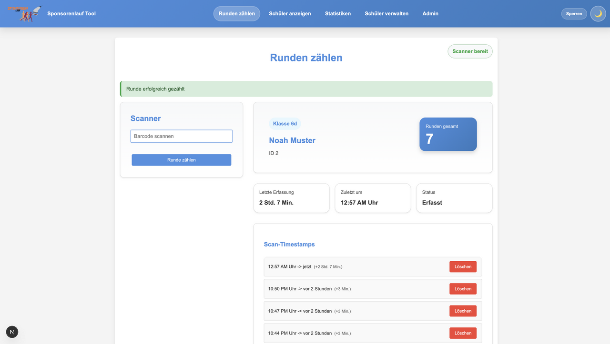
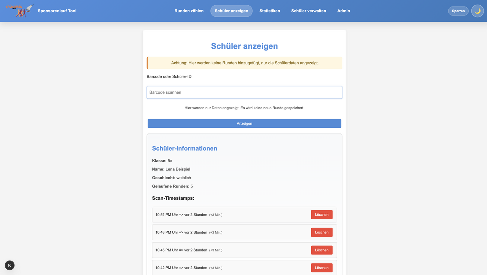
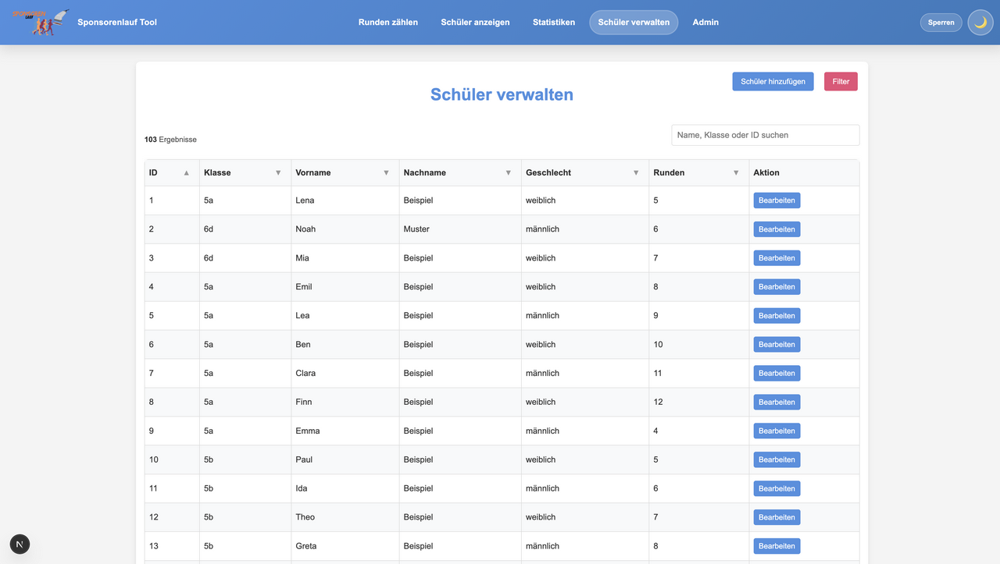
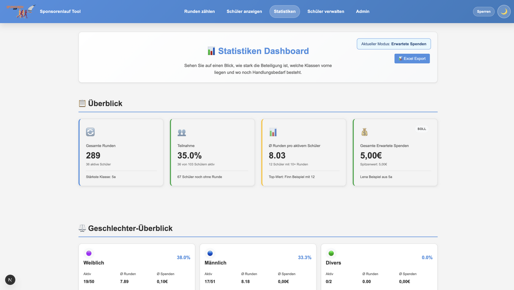
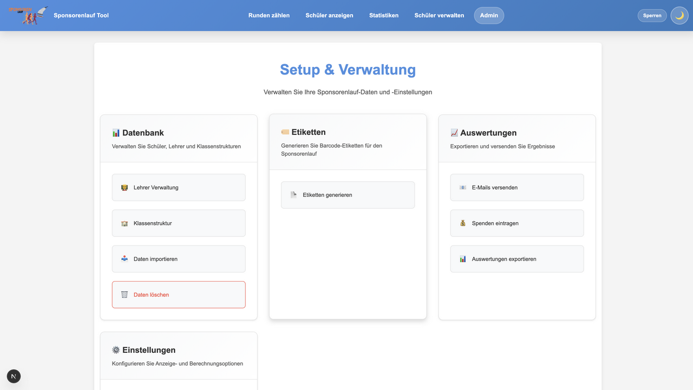

# Sponsorenlauf-Tool

Eine Webanwendung zur digitalen Rundenzählung bei Sponsorenläufen. Jeder Schüler erhält eine eindeutige ID als Barcode. An den Stationen werden die Barcodes mit Laptops und handelsüblichen Barcode-Scannern erfasst.

Die Oberfläche ist derzeit auf Deutsch verfügbar.

## So funktioniert die Installation

Die Anwendung läuft vollständig in Docker. Raspberry Pi OS muss nur noch den WLAN-Hotspot bereitstellen:

- **Docker** enthält Node.js, die Anwendung, alle Abhängigkeiten und SQLite.
- Ein **Docker-Volume** speichert Datenbank und Backups unabhängig vom Container.
- **NetworkManager** erstellt den WLAN-Hotspot und übernimmt DHCP, DNS-Weiterleitung und Routing.
- Port 80 wird direkt veröffentlicht; eine eigene iptables-Regel ist nicht notwendig.

`hostapd`, `dnsmasq`, `dhcpcd`, eine manuelle Node.js-Installation und ein eigener App-systemd-Service werden nicht mehr benötigt. Ein kleiner, fest eingeschränkter Host-Dienst verarbeitet ausschließlich Update- und Neustart-Anfragen aus der PIN-geschützten Weboberfläche; der Anwendung wird dafür kein Docker-Socket bereitgestellt.

## Raspberry Pi: einfache Installation

### Voraussetzungen

- Raspberry Pi 3, 4, 5, Zero W oder Zero 2 W
- Raspberry Pi OS Lite 64-bit (Bookworm oder neuer)
- Ethernet-Verbindung mit Internet während Installation und Updates
- Ein Benutzer mit `sudo`-Rechten und aktiviertes SSH

Beim Schreiben der SD-Karte mit dem [Raspberry Pi Imager](https://www.raspberrypi.com/software/) Benutzer, Passwort, Land und SSH in den erweiterten Einstellungen festlegen. Anschließend den Pi per Ethernet verbinden und starten.

### 1. Repository herunterladen

Per SSH am Raspberry Pi anmelden und ausführen:

```bash
sudo apt-get update
sudo apt-get install -y git
git clone https://github.com/Florian2807/sponsorenlauf-tool.git
cd sponsorenlauf-tool
```

### 2. Einstellungen prüfen

Die Standardwerte funktionieren ohne Änderung. Für einen anderen WLAN-Namen oder ein anderes Passwort:

```bash
cp deployment/install.example.env deployment/install.env
nano deployment/install.env
```

Wichtig: Für eine echte Veranstaltung das Beispielpasswort unbedingt ändern. Das WLAN-Passwort muss mindestens acht Zeichen lang sein.

Ein optionaler Vorabcheck verändert das System nicht:

```bash
bash scripts/check-raspberry-setup.sh
```

### 3. Alles installieren

```bash
bash scripts/install-raspberry.sh
```

Das Script erledigt automatisch:

1. Docker, Docker Compose, NetworkManager und Avahi installieren
2. das fertige ARM64-Docker-Image herunterladen oder bei Bedarf lokal bauen
3. Anwendung, Wartungsdienst und persistentes Daten-Volume einrichten
4. erst danach den WLAN-Hotspot `Sponsorenlauf Backend` aktivieren
5. Erreichbarkeit der Anwendung prüfen

Alle Schritte, die eine Internetverbindung benötigen, laufen vor der Aktivierung des Hotspots. Dadurch kann eine vom Hotspot veränderte Standardroute den Download des Containers nicht unterbrechen.

Das Script ist wiederholbar und kann bei Bedarf erneut ausgeführt werden.

Falls das veröffentlichte Image noch nicht verfügbar ist, baut der Installer es einmalig innerhalb von Docker auf dem Raspberry Pi. Dafür ist keine lokale Node.js-Installation notwendig. Der erste lokale Build kann auf einem Raspberry Pi bis zu 15 Minuten dauern und während der Kompilierung nativer Abhängigkeiten zeitweise so wirken, als gäbe es keinen Fortschritt.

### 4. Anwendung öffnen

Mit dem WLAN `Sponsorenlauf Backend` verbinden und eine der Adressen öffnen:

- `http://10.0.0.1` – funktioniert immer mit der Standardkonfiguration
- `http://sponsorenlauf.local` – einfacher Name über mDNS

Eine Portnummer ist nicht erforderlich. Der zuvor verwendete lokale DNS-Name `sponsorenlauf.de` wird nicht mehr benötigt.

### 5. Ersteinrichtung und Administrator-PIN

Beim ersten Öffnen der Weboberfläche startet automatisch die Ersteinrichtung. Zuerst wird einmalig eine Administrator-PIN aus Ziffern festgelegt. Danach führt eine interaktive Tour direkt durch die echten Seiten der Anwendung. Der jeweils erklärte Bereich wird hervorgehoben und ein kleines Hinweisfenster lässt sich mit **Zurück** und **Weiter** durchklicken.

Die Tour zeigt Admin-Einstellungen, Klassenstruktur, Module und Doppel-Scan-Schutz, Schülerverwaltung, Scan- und Nachschlageansicht, Statistiken, SMTP-Einrichtung sowie Backups und Veranstaltungsbereitschaft. Sie verändert dabei keine Einstellungen automatisch und kann jederzeit übersprungen werden. Alle gezeigten Einstellungen bleiben später unter **Admin** erreichbar.

Danach sind Setup, Schüler- und Lehrerverwaltung, Spenden, E-Mail-Versand, Exporte und alle verändernden API-Aufrufe nur nach Eingabe dieser PIN verfügbar. Die Seiten zum Scannen, Anzeigen und die Live-Statistik bleiben für die Stationen zugänglich.

Die Anmeldung gilt 12 Stunden. Über **Sperren** in der Navigation kann die Verwaltung sofort wieder gesperrt werden. Die PIN lässt sich unter **Setup → Bereitschaft & Sicherheit** ändern.

### 6. E-Mail-Server einrichten

Unter **E-Mails → SMTP-Server einrichten** wird ein vorhandener SMTP-Server vollständig konfiguriert:

- Servername und Port
- TLS, STARTTLS oder unverschlüsselte Verbindung für ein vertrauenswürdiges lokales Relay
- Benutzername und Passwort oder ein lokaler Server ohne Anmeldung
- Absenderadresse und Absendername

Die Verbindung wird vor dem Speichern mit einer echten Test-E-Mail geprüft. SMTP-Passwörter und Microsoft-Client-Secrets werden mit dem nur lokal gespeicherten `SPONSORENLAUF_SECRET_KEY` verschlüsselt und nie wieder an den Browser zurückgegeben. Microsoft 365 wird über Microsoft Graph mit OAuth angebunden und funktioniert dadurch auch bei aktivierter Zwei-Faktor-Authentifizierung; andere Anbieter können über einen eigenen SMTP-Mailserver verbunden werden.

Die Anwendung stellt bewusst keinen öffentlich erreichbaren Mailserver bereit. Sie verbindet sich mit dem SMTP-Dienst der Schule oder eines Mailanbieters – das vermeidet Spam-, DNS-, Zustellbarkeits- und Wartungsprobleme eines eigenen Mailservers.

## Veranstaltung vorbereiten

Unter **Setup → Bereitschaft & Sicherheit** gibt es ein gemeinsames Kontrollzentrum. Es prüft Datenbankintegrität, freien Speicher, ein aktuelles Backup und die SMTP-Konfiguration. Außerdem zeigt es aktive Scannerstationen, den letzten Scan, Version und Laufzeit.

Vor dem Start:

1. Schülerdaten importieren und einen Testscan durchführen.
2. Alle Scannerstationen mindestens einmal öffnen; aktive Geräte erscheinen im Kontrollzentrum.
3. Ein Backup erstellen und über **Herunterladen** auf einem Laptop oder USB-Stick außerhalb des Raspberry Pi speichern.
4. Falls E-Mails benötigt werden, die SMTP-Verbindung testen.

Scanner puffern nicht bestätigte Scans im Browser, wenn der Raspberry Pi vorübergehend nicht erreichbar ist. Nach Wiederherstellung der Verbindung werden sie mit derselben eindeutigen Scan-ID erneut übertragen, sodass Wiederholungen keine zusätzlichen Runden erzeugen. Die Scan-Seite muss dafür geöffnet bleiben und der Browser-Speicher darf nicht gelöscht werden. Doppel-Scans werden weiterhin zur manuellen Bestätigung vorgemerkt.

## Aktualisieren und neu starten

Nach der einmaligen Installation erfolgen Updates und Neustarts unter **Setup → Systemwartung** in der Weboberfläche. Für ein Update muss der Raspberry Pi per Ethernet mit dem Internet verbunden sein.

Vor jedem Update wird automatisch ein geprüftes SQLite-Backup erstellt. Danach werden die aktuellen Installationsdateien und das neue Container-Image geladen. Datenbankmigrationen laufen beim Containerstart automatisch.

Der neue Container muss seinen Healthcheck bestehen. Falls das nicht innerhalb von 90 Sekunden geschieht, stellt das Script automatisch das vorherige Image und das unmittelbar vor dem Update erstellte Datenbank-Backup wieder her.

Der vom Installer eingerichtete Wartungsdienst akzeptiert nur die Aktionen `update` und `restart`. Die Anwendung bekommt bewusst keinen Zugriff auf den Docker-Socket, da dieser praktisch Root-Zugriff auf den Raspberry Pi ermöglichen würde.

## Daten, Backups und Wiederherstellung

Die Produktionsdaten liegen im Docker-Volume `sponsorenlauf-data`. Ein Austausch oder Update des Containers löscht sie nicht.

Volume anzeigen:

```bash
sudo docker volume inspect sponsorenlauf-data
```

Backups können in **Setup → Bereitschaft & Sicherheit** erstellt, heruntergeladen und wiederhergestellt werden. Vor jeder Wiederherstellung prüft die Anwendung die SQLite-Datei und legt zusätzlich ein Sicherheitsbackup des aktuellen Zustands an.

Backups im Container anzeigen:

```bash
sudo docker compose --env-file deployment/production.env -f compose.prod.yaml exec app ls -lah /data/backups
```

Ein heruntergeladenes Backup auf einem anderen Gerät ist vor jeder Veranstaltung dringend empfehlenswert: Dateien im Docker-Volume schützen vor Containerwechseln, aber nicht vor einem defekten oder verlorenen Raspberry Pi. Das Volume nur dann löschen, wenn wirklich alle Anwendungsdaten entfernt werden sollen.

## Terminal-Notfallhilfe

Diese Befehle sind nur für die Fehlerdiagnose vorgesehen, falls die Weboberfläche nicht mehr erreichbar ist. Im normalen Betrieb werden Status, Backups, Updates und Neustarts im Web verwaltet.

```bash
# Status
sudo docker compose --env-file deployment/production.env -f compose.prod.yaml ps

# Logs
sudo docker compose --env-file deployment/production.env -f compose.prod.yaml logs -f app

# Neustart
sudo docker compose --env-file deployment/production.env -f compose.prod.yaml restart app

# Stoppen
sudo docker compose --env-file deployment/production.env -f compose.prod.yaml down

# Wieder starten
sudo docker compose --env-file deployment/production.env -f compose.prod.yaml up -d
```

`docker compose down` behält das Daten-Volume. Keinesfalls `docker compose down --volumes` verwenden, wenn die Daten erhalten bleiben sollen.

## Lokale Entwicklung auf Windows, macOS und Linux

Die Entwicklungsumgebung verwendet immer Port `3000` und eine eigene Datenbank. Sie führt weder den Raspberry-Installer noch NetworkManager-, systemd- oder Host-Netzwerk-Befehle aus.

### Direkt mit Node.js

Node.js 20.9 oder neuer wird benötigt. Migrationen und das lokale Datenverzeichnis werden automatisch vorbereitet:

```bash
npm ci
npm run dev
```

Die Anwendung ist anschließend unter `http://localhost:3000` verfügbar. Entwicklungsdaten liegen ausschließlich unter `.local-data/`.

### Mit Docker Desktop

Alternativ startet eine vollständig isolierte Entwicklungs-Compose-Datei nur die Anwendung:

```bash
docker compose -f compose.dev.yaml up --build
```

Danach ist die Anwendung unter `http://localhost:3000` erreichbar. Sie verwendet die getrennten Volumes `sponsorenlauf-dev-data` und `sponsorenlauf-dev-node-modules`; Produktionsdaten können dadurch nicht versehentlich geöffnet oder migriert werden.

### Produktionsumgebung

`compose.prod.yaml` ist ausschließlich für den Raspberry Pi bestimmt. Sie verwendet Port `80`, das bestehende Produktionsvolume `sponsorenlauf-data`, das veröffentlichte Produktions-Image und den vom Installer erzeugten geheimen Schlüssel. Sie sollte auf einem Entwicklungsrechner nicht gestartet werden.

## Docker-Image veröffentlichen

Der Workflow `.github/workflows/docker-publish.yml` baut bei Änderungen auf `main` automatisch Images für `linux/amd64` und `linux/arm64` und veröffentlicht sie unter:

```text
ghcr.io/florian2807/sponsorenlauf-tool:latest
```

Das GitHub-Paket muss öffentlich lesbar sein, damit neue Raspberry Pis das Image ohne Registry-Anmeldung herunterladen können.

Vor der Veröffentlichung laufen Tests, ESLint, der Produktions-Build und ein Audit auf kritische Produktionsabhängigkeiten. Das Image wird mit Herkunftsnachweis und Software-Stückliste (SBOM) veröffentlicht. Dependabot prüft npm-, Docker- und GitHub-Actions-Abhängigkeiten regelmäßig.

## Screenshots

<details>
  <summary>Screenshots anzeigen</summary>

  ### Runden zählen
  

  ### Schüler anzeigen
  

  ### Schüler verwalten
  

  ### Statistiken
  

  ### Setup
  
</details>
