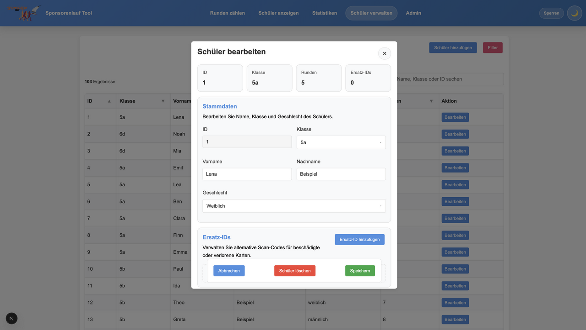

# Sponsorenlauf-Tool

🚀 **Modernes Sponsorenlauf-Management**  
Eine innovative digitale Lösung als Alternative zu herkömmlichen Stempelkarten bei Sponsorenläufen.

🌍 The tool is currently only available in German. If you want an English version or have special requirements, please create an issue or pull request! I'm happy to help. If you want to test a demo version, just write to me and I'll give you access.

---

## 💡 Prinzip
Jeder Schüler erhält eine eindeutige ID, die in der Datenbank hinterlegt ist. Diese ID wird ausgedruckt und verteilt. Beim Sponsorenlauf können die Schüler ihre ID an verschiedenen Stempelstationen (mit Barcode-Scannern) einlesen lassen.

### 🏁 Stempelstationen
- Raspberry Pi fungiert als WLAN-Router mit einem laufenden Script.
- Mindestens ein Laptop mit angeschlossenem Barcode-Scanner.
- Laptop muss mit dem WLAN des Raspberry Pi verbunden sein.

---

## 📸 Screenshots

<details>
  <summary><b>Screenshots anzeigen</b></summary>

  ### Scan-Ansicht:
  

  ### Daten eines Schülers abrufen
  

  ### Schüler-Management:
  

  ### Einzelne Schüler bearbeiten:
  

  ### Statistiken:
  

  ### Setup:
  

</details>

---

## 🚀 Installation

### 🖥️ Raspberry Pi Setup
Schau dir die [Anleitung](/raspberrySetup.md) an, wie du den Raspberry Pi installieren musst. 

Für die geplante Vereinfachung per Setup-Script gibt es zusätzlich einen technischen Plan unter [docs/raspberry-setup-script-plan.md](./docs/raspberry-setup-script-plan.md).

Vor der eigentlichen Automatisierung kannst du bereits einen reinen Vorabcheck ausführen:

```bash
cp deployment/install.example.env deployment/install.env
bash ./scripts/check-raspberry-setup.sh
```

Das Script prüft unter anderem zuerst, ob Internet vorhanden ist, und validiert danach OS, Interfaces, Node, `systemd` und wichtige Zielpfade, ohne etwas zu verändern.

Für die eigentliche automatisierte Installation gibt es jetzt außerdem ein erstes Setup-Script:

```bash
cp deployment/install.example.env deployment/install.env
bash ./scripts/install-raspberry.sh
```

Aktuell orientiert sich das Script eng an den bestehenden Schritten aus dieser README:

- Internet wird vor dem eigentlichen Lauf geprüft
- Systempakete werden installiert
- Repository und App werden vorbereitet
- `npm ci`, `npm rebuild sqlite3 --build-from-source`, versionierte Datenbankmigrationen und `npm run build` werden ausgeführt
- `systemd`, `sudoers`, `hostapd`, `dnsmasq`, `dhcpcd` und `iptables` werden gesetzt

### ⚙️ Node.js + NPM Installation
1. Verbinde dich per SSH mit deinem Raspberry:
    ```bash
    ssh <benutzer>@raspberry.local
    ```
2. Aktualisiere dein System:
    ```bash
    sudo apt update && sudo apt upgrade
    ```
3. Installiere Node.js:
    ```bash
    curl -fsSL https://deb.nodesource.com/setup_20.x | sudo -E bash -
    sudo apt install -y nodejs
    ```

### 📁 Repository Setup
1. **Klone das Repository**:
    ```bash
    git clone https://github.com/Florian2807/sponsorenlauf-tool.git
    cd sponsorenlauf-tool
    ```
> [!NOTE]
> Falls `git` noch nicht installiert ist, installiere es mit:
> ```bash
> sudo apt install git
> ```


2. **Installiere alle benötigten Pakete**:
    ```bash
    npm install
    ```

3. **Initialisiere die Datenbank**:
    ```bash
    node initDB.js
    ```

4. **Erstelle das Build**:
    ```bash
    npm run build
    ```

---

## ⏩ Systemd - Prozessmanagement
Verwende **systemd**, um das Tool dauerhaft im Hintergrund laufen zu lassen.

1. **Erstelle eine systemd Service-Datei**:
    ```bash
    sudo nano /etc/systemd/system/sponsorenlauf.service
    ```
    Füge folgenden Inhalt ein (passe ggf. den Pfad und Benutzer an):
    ```ini
    [Unit]
    Description=Sponsorenlauf Tool
    After=network.target

    [Service]
    Type=simple
    User=pi
    WorkingDirectory=/home/pi/sponsorenlauf-tool
    ExecStart=/home/pi/sponsorenlauf-tool/scripts/start-with-update.sh
    Restart=always
    Environment=NODE_ENV=production

    [Install]
    WantedBy=multi-user.target
    ```

2. **Service neu laden und aktivieren**:
    ```bash
    sudo systemctl daemon-reload
    sudo systemctl enable sponsorenlauf
    sudo systemctl start sponsorenlauf
    ```

3. **Status prüfen**:
    ```bash
    sudo systemctl status sponsorenlauf
    ```

4. **Logs anzeigen**:
    ```bash
    sudo journalctl -u sponsorenlauf -f
    ```

### 🔄 Frontend-Update / Auto-Update beim Neustart

Der vollständige Ablauf, die Aktivierung auf bestehenden Kundengeräten und Regeln für neue Migrationen sind in [docs/startup-updates.md](./docs/startup-updates.md) beschrieben.

Damit die neue Wartungsfunktion im Frontend funktioniert und bei jedem Neustart automatisch `git pull`, `npm ci` und `npm run build` ausgeführt werden, sind auf dem Raspberry noch zwei zusätzliche Schritte nötig:

1. **Skripte ausführbar machen**
   ```bash
   chmod +x /home/pi/sponsorenlauf-tool/scripts/start-with-update.sh
   chmod +x /home/pi/sponsorenlauf-tool/scripts/system-maintenance-runner.mjs
   ```

2. **sudo-Recht für den Restart aus dem Frontend erlauben**
   ```bash
   sudo visudo -f /etc/sudoers.d/sponsorenlauf-maintenance
   ```
   Inhalt:
   ```sudoers
   pi ALL=NOPASSWD: /bin/systemctl restart sponsorenlauf
   ```

4. **Wichtiges Verhalten des Start-Skripts**
   - Vor Migrationen wird eine geprüfte SQLite-Sicherheitskopie unter `backups/` erstellt.
   - Die Migrationen der bereits installierten Version laufen bei jedem Start – auch ohne Internet.
   - Mit Internet wird `origin/main` abgerufen. Nur wenn ein neuer Fast-Forward-Stand vorhanden ist, folgen `npm ci`, der lokale `sqlite3`-Build, die Migrationen der neuen Version und `npm run build`.
   - Ist kein Update vorhanden, werden die langsamen Installations- und Build-Schritte übersprungen.
   - Bei lokalen Änderungen oder einem abweichenden Git-Verlauf wird kein automatisches Update erzwungen.
   - Schlägt ein Update nach dem Git-Wechsel fehl, werden Git-Stand, Abhängigkeiten, Datenbank und Produktions-Build automatisch auf den vorherigen Stand zurückgesetzt.
   - Die Anwendung startet nicht, wenn bereits die lokalen Datenbankmigrationen fehlschlagen. So läuft kein neuer Code gegen ein unbekanntes Schema.
   - Standardmäßig bleiben die neuesten 20 automatisch erzeugten Datenbank-Sicherungen erhalten. Der Wert kann über `SPONSORENLAUF_MAX_BACKUPS` geändert werden.

   Die Update-Quelle kann in der systemd-Unit konfiguriert werden:
   ```ini
   Environment=SPONSORENLAUF_UPDATE_REMOTE=origin
   Environment=SPONSORENLAUF_UPDATE_BRANCH=main
   Environment=SPONSORENLAUF_MAX_BACKUPS=20
   ```

5. **Hinweis zu Raspberry Pi OS Bookworm und sqlite3**
   `Raspberry Pi OS Lite (64-bit)` auf Basis von Debian Bookworm ist dafür grundsätzlich korrekt.
   Auf einigen Geräten zieht `npm ci` für `sqlite3` jedoch ein vorgebautes Binary, das eine neuere `glibc` erwartet als auf Bookworm vorhanden ist.
   Deshalb baut das Wartungsskript `sqlite3` nach `npm ci` zusätzlich lokal neu:
   ```bash
   npm rebuild sqlite3
   ```
   Das kann auf dem Raspberry mehrere Minuten dauern und ist beim ersten Lauf normal.

> [!TIP]
> Eine Beispiel-Datei liegt auch im Repo unter `deployment/systemd/sponsorenlauf.service.example`.

---

## 📶 Raspberry Pi als Access Point konfigurieren
Um den Raspberry Pi als Router zu nutzen, folge diesen Schritten:

1. **Installiere benötigte Pakete**:
    ```bash
    sudo apt install hostapd dnsmasq iptables-persistent dhcpcd
    ```

2. **Deaktiviere den NetworkManager**:
    ```bash
    sudo systemctl stop NetworkManager && sudo systemctl disable NetworkManager
    ```

3. **Hostapd konfigurieren**:
    - Öffne die Datei:
      ```bash
      sudo nano /etc/hostapd/hostapd.conf
      ```
    - Füge folgendes hinzu:
        ```bash
        interface=wlan0
        driver=nl80211
        country_code=DE
        ssid=Sponsorenlauf Backend
        hw_mode=a
        channel=44
        ieee80211n=1
        ieee80211ac=1
        wmm_enabled=1
        wpa=2
        wpa_passphrase=Sponsorenlauf!
        wpa_key_mgmt=WPA-PSK
        rsn_pairwise=CCMP
        ```

4. **Hostapd aktivieren**:
    ```bash
    sudo nano /etc/default/hostapd
    ```
    Füge diese Zeile hinzu:
    ```bash
    DAEMON_CONF="/etc/hostapd/hostapd.conf"
    ```

5. **dnsmasq konfigurieren**:
    - Bearbeite die Datei:
      ```bash
      sudo nano /etc/dnsmasq.conf
      ```
    - Füge diese Zeilen hinzu:
      ```bash
      interface=wlan0
      dhcp-range=10.0.0.5,10.0.0.200,255.255.255.0,24h
      address=/sponsorenlauf.de/10.0.0.1
      ```

6. **dhcpcd konfigurieren**:
    ```bash
    sudo nano /etc/dhcpcd.conf
    ```
    Füge diese Zeilen hinzu:
    ```bash
    interface wlan0
        static ip_address=10.0.0.1/24
        nohook wpa_supplicant
    ```

7. **iptables für Routing einrichten**:
    - Aktiviere die Weiterleitung:
      ```bash
      sudo nano /etc/sysctl.conf
      ```
    - Entferne das `#` vor der Zeile `net.ipv4.ip_forward=1`.

    - Setze die iptables-Regeln:
      ```bash
      sudo iptables -t nat -A POSTROUTING -o eth0 -j MASQUERADE && sudo iptables -A FORWARD -i eth0 -o wlan0 -m state --state RELATED,ESTABLISHED -j ACCEPT && sudo iptables -A FORWARD -i wlan0 -o eth0 -j ACCEPT && sudo chmod 644 /etc/iptables/rules.v4 && sudo iptables -t nat -A PREROUTING -p tcp --dport 80 -j REDIRECT --to-port 3000
      ```

    - Speichere die iptables-Regeln:
      ```bash
      sudo sh -c "iptables-save > /etc/iptables/rules.v4" && sudo sh -c iptables-restore < /etc/iptables/rules.v4
      ```

8. **Alle Dienste aktivieren**:
    ```bash
    sudo systemctl unmask dhcpcd && sudo systemctl enable dhcpcd && sudo systemctl start dhcpcd
    sudo systemctl unmask hostapd && sudo systemctl enable hostapd && sudo systemctl start hostapd
    sudo systemctl enable dnsmasq && sudo systemctl start dnsmasq
    ```

9. **Raspberry Pi neu starten**:
    ```bash
    sudo reboot
    ```

---

## 🌐 Zugriff auf die Anwendung im Netzwerk

Nach der Einrichtung kannst du die Sponsorenlauf-Anwendung auf verschiedene Weise erreichen:

### 📱 Einfacher Zugriff über DNS
Die Anwendung ist über den konfigurierten DNS-Eintrag erreichbar:
- **URL**: `http://sponsorenlauf.de`
- **Alternative**: `http://www.sponsorenlauf.de`

### 🔢 Direkter IP-Zugriff
Falls der DNS-Eintrag nicht funktioniert, kannst du direkt über die IP-Adresse zugreifen:
- **Raspberry Pi IP**: `http://10.0.0.1`
- **Mit Port**: `http://10.0.0.1:3000` (falls die Port-Weiterleitung nicht aktiv ist)

### ✅ Verbindungstest
Um sicherzustellen, dass alles funktioniert:
1. Verbinde dein Gerät mit dem WLAN `Sponsorenlauf Backend`
2. Öffne einen Browser und gehe zu `http://sponsorenlauf.de`
3. Die Sponsorenlauf-Anwendung sollte sich öffnen

> [!TIP]
> **Port-Weiterleitung**: Die iptables-Regel leitet automatisch HTTP-Traffic (Port 80) auf den Node.js-Server (Port 3000) weiter, sodass du keine Portnummer in der URL angeben musst.

---

### Fertig! Dein Sponsorenlauf-Tool sollte nun einsatzbereit sein. 🎉
